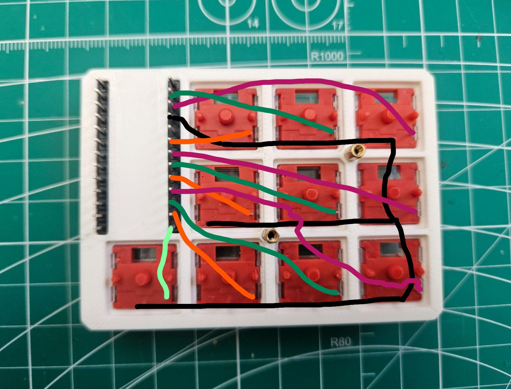

# Diodeless Iskra

A version of the Iskra macropad with no diodes.

The original Iskra is available:
- [Github](https://github.com/vostoklabs/Iskra-handwire-numpad/tree/main)
- [MakerWorld](https://makerworld.com/en/models/1859378-iskra-numpad-handwired-customizable-low-profile#profileId-1988494).

Everything but the wiring and the firmware still the same and they have very complete documentation on how to build it.

*Some parts of this README were written with AI tools.*
## Wiring

- One leg of each switch is tied together into a **single ground rail**, which then goes to **GND** on the MCU.
- The other leg from each switch goes to its **own GPIO pin** on the MCU.
- On [nice!nano and compatible boards](https://nicekeyboards.com/docs/nice-nano/pinout-schematic/), **pins 0 and 1 are physically swapped**, wire them as shown in the diagram.

Because the design is diode-less, this is a straight “one pin per key” setup.



## Using This Repo as a ZMK Module

This repository is meant to be used as a **ZMK module** alongside your `zmk-config`.

### 1. Add the module to `config/west.yml`

Open `config/west.yml` in your `zmk-config` repo and add a remote + project entry for this module, following the current ZMK module docs.

Example:

```yaml
manifest:
  remotes:
    - name: zmkfirmware
      url-base: https://github.com/zmkfirmware
    - name: coredump                            # <-- add this
      url-base: https://github.com/coredump     # <-- and this
  projects:
    - name: zmk
      remote: zmkfirmware
      revision: main      # or your pinned ZMK version, e.g. v0.2
      import: app/west.yml
    - name: zmk-keyboard-diodeless-iskra        # <-- add this
      remote: coredump                          # <-- and this
      revision: main                            # <-- and this 
```